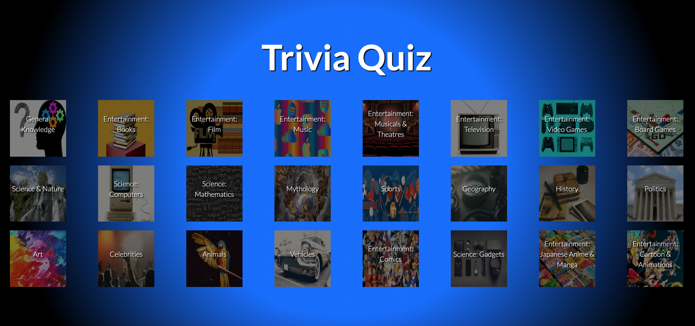
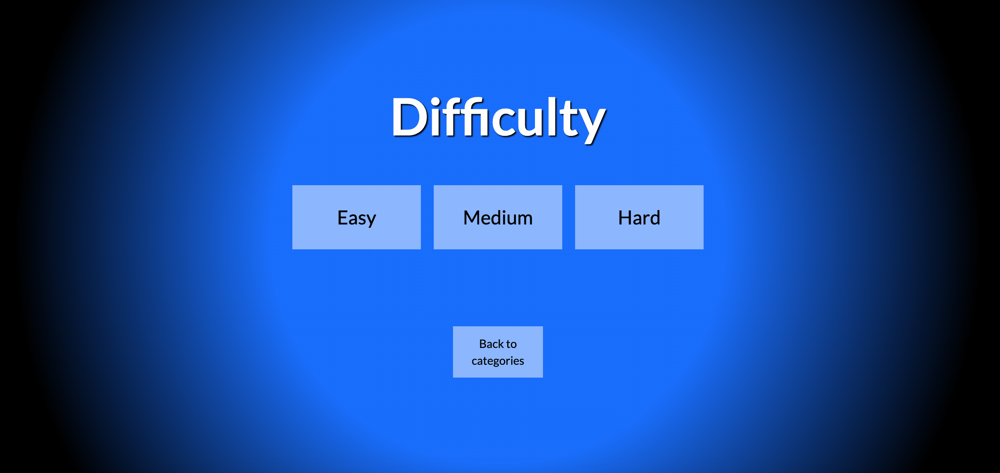
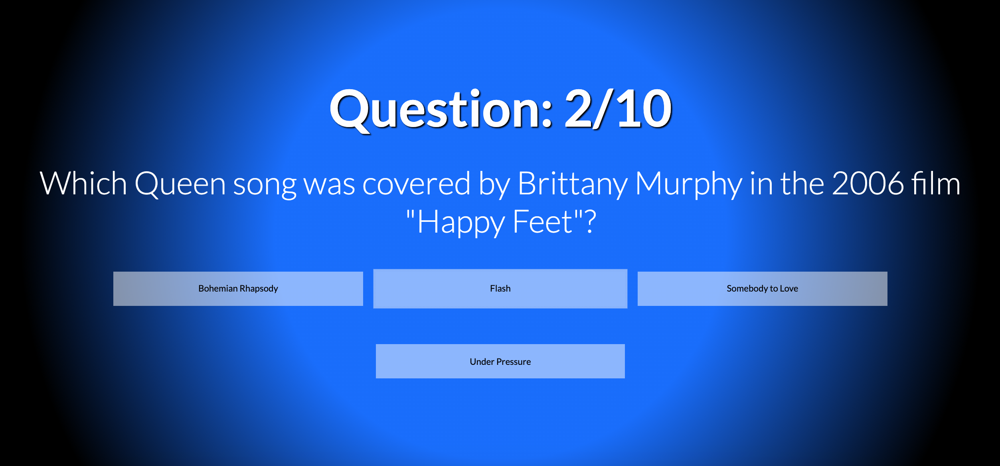

# Trivia Quiz

## Overview

Two day paired hackathon. Using React, we created a Trivia app using an open source Trivia API and the Bootstrap framework. Part of the General Assembly SEI bootcamp. 

The app generates 10 questions from the API in three different difficulties and from 23 categories.

[CHECK IT OUT HERE ](https://kasjanhinc.github.io/trivia/)

# Brief

Thhe pages were structured to pass on variables on the users choice of category and difficulty. We used React Router to link the pages.

```js 
  <BrowserRouter>
    <Switch>
      <Route exact path="/project-2" component={Home}/>
      <Route exact path="/project-2/difficulty/:categoryId" component={Difficulty}/>
      <Route exact path="/project-2/:categoryId/:difficultyId/question" component={Question}/>
      <Route exact path="/project-2/question/:score" component={Score} />
    </Switch>
  </BrowserRouter>
```

We used the following React modules:

- Axios: for fetching data from our API

```js
  useEffect(() => {

    axios.get('https://opentdb.com/api_category.php')
      .then(resp => {
        const data = resp.data
        updateCategories(data.trivia_categories)
      })
  }, [])
```

- React Reveal: for entry effects in some components.

```js
    </Bounce>
    <Bounce bottom appear={true}>
      <Link to={`/project-2`}>
        <button className="btn btn-outline-light btn-lg btn-end">
          Play Again!
        </button>
      </Link>
    </Bounce>
```

Our API was the OpenTDB: https://opentdb.com/api_config.php

## Home



To have our categories displayed, we mapped the data from the API to the page. For the images, we mapped them with an index, where each index corresponded to a local file name. 

Based on which category the user chose, the correct category index was passed on to the difficulties page inside the pathname.

```js
        {categories.map((category, index) => {

          const number = index
         
          return <div className="col text-center" key={index}>

            <Link to={`/project-2/difficulty/${category.id}`} key={index}>
              

              <button className="btn btn-outline-light btn-lg btn-home" key={index}>
                <p className="text-center">{category.name}</p>
              </button>

            </Link>

          </div>
        })}


```

## Difficulties



Here we can see the same concept as before, where each difficulty button takes the user to the corresponding pathname. The names of the difficulties represent the pathnames for the different endpoints available in our API.

```js
<Link to={`/project-2/${categoryId}/${'easy'}/question`}>
          <button className="btn btn-outline-light btn-lg btn-diff">
            Easy
        </button>
        </Link>
```

## Question Page



Here we are retrieving the data from the props and creating a url based on the difficulty and category that the user chose. To achieve this we used the method props.match.params.

```js
  const difficultyId = props.match.params.difficultyId
  const categoryId = props.match.params.categoryId
  const url = `https://opentdb.com/api.php?amount=10&category=${categoryId}&difficulty=${difficultyId}&type=multiple`

  useEffect(() => {

    axios.get(url)
      .then(resp => {
        const data = resp.data
        updateQuestions(data)

      })
  }, [])
```

One of the challenges faced was the API returned possible answers as an array AND a single value.
To solve this we used a method of .flat and .sort to randomise the order of the question answers.

```js
  const questionArray = []

  questionArray.push(questions.results[questionNo].incorrect_answers, questions.results[questionNo].correct_answer)
  const questionArrayFlat = questionArray.flat()
  const questionArrayRand = questionArrayFlat.sort()
```
We used React Reveal to make animated entries of the questions on render. In this case the Zoom entry makes each question zoom in on entry.

```js
return <div className="container home">

    <Zoom spy={questionNo} appear={true}>
      <div className="row text-center">
```

After mapping the question array, which we received from our API, we used a mixture of useState and array index to generate and update the questions. We tracked the users score and the amount of questions they answered  to know when to end the quiz.

The data from our API presented HTML symbols which wouldn't render in our page, so we had to substitute for example /&quot;/ to "".

```js
{gamePlay ? <div>
              {questionArrayRand.map((question, key) => {
                return <button key={key} className="btn btn-outline-light btn-lg btn-question" onClick={() => {
                  const answer = (questions.results[questionNo].correct_answer)

                  if (answer === question) {
                    updatePoints(playerPoints + 1)
                  }
                  if (questionNo < 9) {
                    nextQuestion(questionNo + 1)
                  } else {
                    updateGame(false)

                  }
                }}>{question.replace(/&quot;/g, '"').replace(/&#039;/g, '`').replace(/&amp;/g, '&')}</button>

              })} </div> : null}
```

## Bugs (Fixed)

- Our images wouldn't load after we pushed our project to GitHub, because of the local file paths being relative to our local folder. We solved this by changing the root folder pathname to window.location.href.

- Our API didn't have enough questions available for the true/false type. This meant we had to switch to multiple choice questions to get a large variety of questions to work.
 
## Potential Future Features

- To make a button allowing the user to switch between 10/20 and more questions in the quiz.

- Auto generate category images from a separate API instead of hosting the images locally.

## Colaborators

- Lee Burgess
